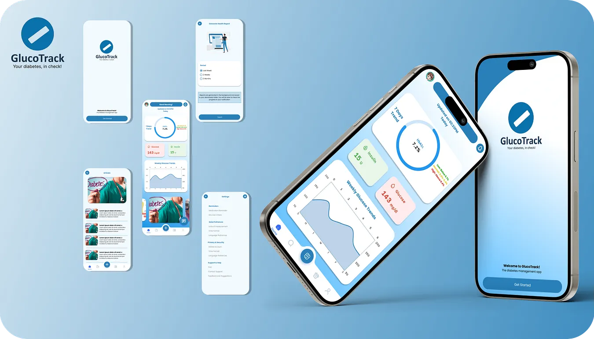

# GlucoTrack

GlucoTrack is a mobile application designed to help diabetic individuals monitor their glucose levels and track HbA1c trends over time. The app provides a simple interface to input daily glucose readings and visualize weekly trends through an intuitive graph. The app also calculates HbA1c levels based on user-provided data for better diabetes management.

## Features
* HbA1c Trend Visualization: Displays weekly trends in glucose levels with a clear and interactive line graph.
* Data Input: Allows users to add daily glucose readings.
* Dynamic Onboarding: Collects user-specific information like age, diabetes type, and recent HbA1c levels to personalize the experience.
* Local Data Storage: Utilizes sqflite to store user data locally on the device for offline access.
* User-Friendly Interface: Clean and minimal design tailored for ease of use.

---

Here's a look at the GlucoTrack app in action:

